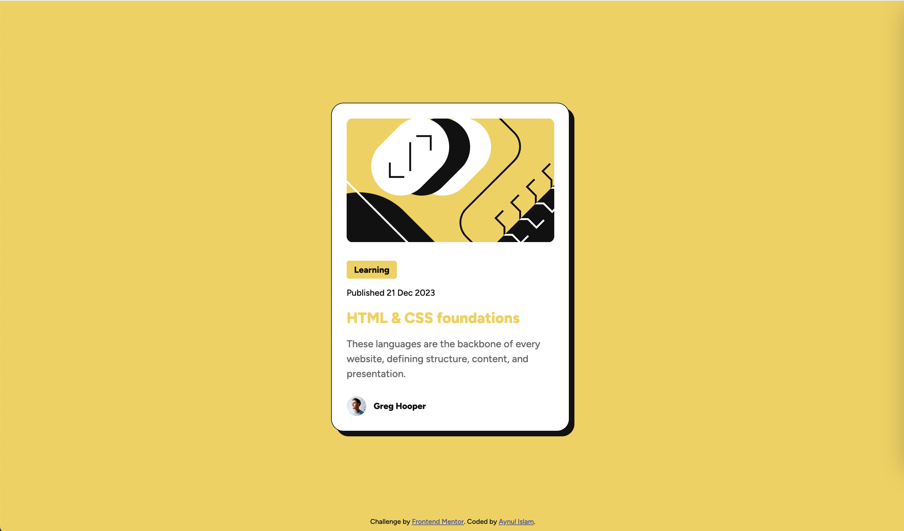

# Frontend Mentor - Blog preview card solution

This is a solution to the [Blog preview card challenge on Frontend Mentor](https://www.frontendmentor.io/challenges/blog-preview-card-ckPaj01IcS). Frontend Mentor challenges help you improve your coding skills by building realistic projects. 

## Table of contents

- [Overview](#overview)
  - [The challenge](#the-challenge)
  - [Screenshot](#screenshot)
  - [Links](#links)
- [My process](#my-process)
  - [Built with](#built-with)
  - [What I learned](#what-i-earned)
  - [Continued development](#continued-development)
  - [Useful resources](#useful-resources)
- [Author](#author)
- [Acknowledgments](#acknowledgments)

## Overview
This project is a HTML and CSS based project of Blog preview card. Cards are image on the top followed by some text in a rectangular area. In this project angle brackets’ SVG image is used as card-image.

### The challenge

Users should be able to:

- See hover and focus states for all interactive elements on the page

### Screenshot
For Desktop: Hover State

For Mobile:

### Links

- Solution URL: [Github Page](https://github.com/nayan041/Blog-preview-card.git)
- Live Site URL: [Frontend Mentor’s Blog preview card website](https://nayan041.github.io/Blog-preview-card/)

## My process

### Built with

- Semantic HTML5 markup
- CSS custom properties
- Flexbox
- Desktop-first workflow
- Media Query

### What I learned
Spacing is very much complicated to me. It is important to maintain proper spacing using CSS. Media Query, `box-shadow`, `.root` pseudo class, `var()` method and variable `@font-face` using methods.

Figma design related guide and Git related learning is very much helpful. Thanks to **Frontend Mentor** for written guidance.

### Continued development
CSS proper spacing and HTML nested structure limiting techniques.

### Useful resources

-  [Jonas’ Course on Udemy regarding  HTML and CSS](https://www.udemy.com/course/design-and-develop-a-killer-website-with-html5-and-css3/?couponCode=ST22MT92324A) - This website helped me for growing confidence on Card building.

## Author

- Frontend Mentor - [@nayan041](https://www.frontendmentor.io/profile/nayan041)

## Acknowledgments
 - Frontend Mentor
 - MDN
